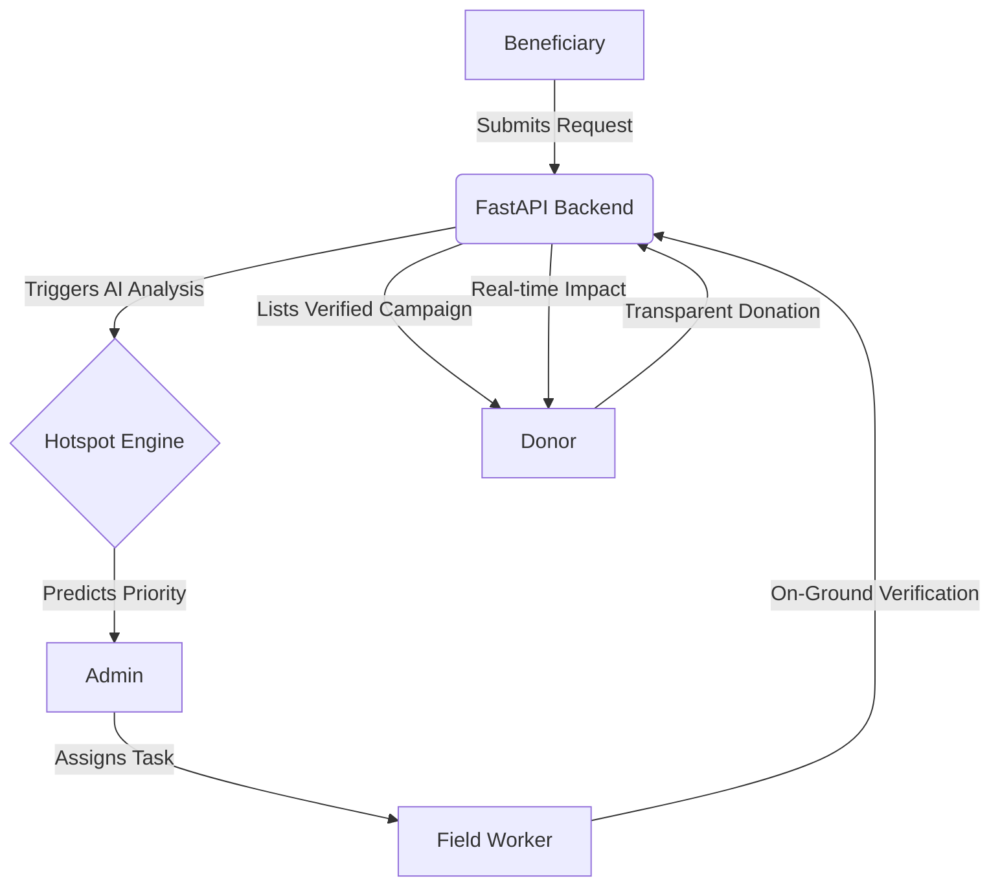

# ChainCare: AI-Powered Philanthropy Platform 🤝

ChainCare is a comprehensive digital ecosystem designed to bring transparency, efficiency, and data-driven insights to the philanthropic sector. By bridging the gap between donors, beneficiaries, and field workers through a unified web interface, ChainCare ensures that every contribution is maximized and every need is verified.

---

## 📑 Table of Contents
1. [Executive Summary](#-executive-summary)
2. [The Problem Statement](#-the-problem-statement)
3. [The Digital Solution](#-the-digital-solution)
4. [Machine Learning Engine](#-machine-learning-engine)
5. [User Roles & Web Portals](#-user-roles--web-portals)
6. [Technical Stack](#-technical-stack)
7. [Database Schema](#-database-schema)
8. [Getting Started](#getting-started)

---

## 🚀 Executive Summary
ChainCare transforms traditional donation models into a verifiable data-driven ecosystem. The platform leverages a **Gradient Boosting AI model** to identify regional hotspots of high need and utilizes a coordinated network of field workers to verify ground-level requirements. The result is a platform where donors have absolute confidence and beneficiaries receive targeted support.

## ⚠️ The Problem Statement
- **Information Asymmetry**: Donors lack visibility into the ground-level impact of their contributions.
- **Priority Gaps**: Resource allocation is often reactive rather than predictive, leaving critical needs unmet.
- **Verification Complexity**: Manually verifying thousands of aid requests is slow and prone to error.
- **Fragmented Data**: Lack of a centralized system to track fundraising, verification, and disbursement.

## 🏗️ The Digital Solution
ChainCare is more than just a donation site; it is a **Centralized Verification & Allocation Hub**.

### 🎨 Premium User Experience
The website is built with a **clean, modern design system**, utilizing solid surfaces and vibrant accents to create a premium, trustworthy feel. Key UI features include:
- **Interactive Heatmaps**: Real-time visualization of high-priority zones using Leaflet.js.
- **Impact Dashboards**: Data-rich environments for all users to track progress through Recharts and Chart.js.
- **Mobile-Responsive Workflows**: Field workers can submit verification reports directly from their mobile devices while on-site.

### 🔄 Integrated Workflow


## 🧠 Machine Learning Engine
The platform's intelligence layer identifies "High-Need Hotspots" to guide admin decisions and donor focus.

- **Model**: `GradientBoostingClassifier` trained on localized Maharashtra regional data.
- **Feature Set**: Analyzes `fulfillment_ratio`, `donation_count`, `goal_amount`, and thematic categories.
- **Capabilities**: Predicts a **Priority Score** for each campaign, highlighting regions (Mumbai, Pune, Nagpur, etc.) that are critically underfunded.

## 👥 User Roles & Web Portals

### 🏢 Admin Command Center
- **ML Oversight**: Monitor and retrain the hotspot model with live transaction data.
- **Verification Queue**: Centralized control for assigning workers and approving verified campaigns.
- **Global Analytics**: High-level KPIs tracking total raised funds and platform-wide impact.

### 📍 Field Worker Portal
- **On-Ground Reporting**: Structured forms for hospital invoice verification and identity checks.
- **Evidence Management**: Image upload capabilities for geo-tagged proof of existence.
- **Task Tracking**: Personalized queue of assigned verification tasks.

### 💖 Donor Portal
- **Verifiable Impact**: Every donation is tagged with a "Verified" status once processed.
- **Impact Graphing**: Visual history of contributions showing personal growth in philanthropic impact.
- **Direct Support**: One-click donations to high-priority hotspots identified by the AI.

### 📝 Beneficiary Dashboard
- **Transparency Tools**: Real-time tracking of raised funds vs. goals.
- **Direct Aid Requests**: A streamlined process for individuals to request specific assistance.

## 🛠️ Technical Stack

### Frontend
- **React 19 (Vite)**: High-performance component-based UI.
- **CSS Modules**: Scoped styling using a custom clean design theme.
- **Data Visualization**: Recharts, Chart.js, and Leaflet.js for interactive mapping.
- **Lucide Icons**: Consistent, modern iconography.

### Backend
- **FastAPI (Python)**: High-performance asynchronous API framework.
- **SQLAlchemy 2.0**: Robust ORM for complex data relationships.
- **Machine Learning**: Scikit-learn, Pandas, and Joblib for predictive modeling.
- **Security**: JWT-based authentication with Bcrypt hashing.

### Database
- **SQLite**: Local development database for rapid iteration and persistence.

## 🚀 Getting Started

### Prerequisites
- Node.js 18+
- Python 3.9+

### Installation
1. **Clone the repository**:
   ```bash
   git clone <repository-url>
   ```
2. **Backend Setup**:
   ```bash
   cd backend
   python -m venv .venv
   source .venv/bin/activate  # Windows: .venv\Scripts\activate
   pip install -r requirements.txt
   python seed_demo_data.py   # Populates demo data
   uvicorn app.main:app --reload
   ```
3. **Frontend Setup**:
   ```bash
   cd frontend
   npm install
   npm run dev
   ```

---
*ChainCare is built for impact, transparency, and data-driven philanthropy.*